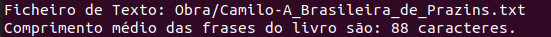
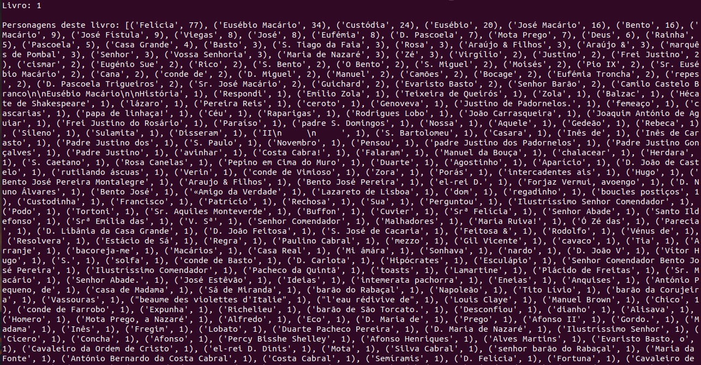

<h2>University of Minho - Natural Language Processing (NLP)</h2>

This was an Study of a Master's course, about Python libraries like SpaCy for Natural Language Processing. 

<h1>Processamento de Linguagem Natural</h1>

<p>1 - Listar as obras de Camilo existentes na pasta Obra / do nosso repositório. Ou seja apresentar a lista dos ficheiros de texto existentes nessa pasta.

- A variável “x” recebe o caminho de um diretório, e busca todos os arquivos (*) com a extensão “.txt” dentro do mesmo.
- Para tal, utiliza-se da função “glob”, oferecida pela extensão “jjcli”, que permite fazer uma busca “global” dentro de um diretório.
- “y” representa cada “item/índice” encontrado dentro da pasta "Obra" com a extensão ".txt".<p>


```python
from jjcli import *

x = glob("Obra/*.txt")

for y in x:
	print(y)
```

<i>Output:</i>


<p>2 - Tílulo e autor de um livro Dado um livro (ficheiro de texto, ex: Amor_de_predição.txt) mostrar as duas primeiras frases.
    
- A variável “cl” recebe como parâmetro o caminho de um arquivo de extensão ".txt" - "Obra/Camilo-A_Brasileira_de_Prazins.txt" e o filtra.

<i>No terminal Ubuntu:<br>
python3 exercise_2.py Obra/Camilo-A_Brasileira_de_Prazins.txt</i>

- A variável "c" é um contador que recebe o valor inicial de 0.

- “x” representa cada “índice/linha” encontrada dentro do arquivo filtrado pela variável "cl".
- O laço "for" imprime cada linha encontrada no arquivo filtrado, e atribui + 1 a variável "c", até que "c" possua valor maior do que 3.

- Obs.: Ao invés de imprimir apenas as duas primeiras linhas, como pedia o exercício, eu, propositalmente, fiz com que o script imprimi-se as 5 primeiras linhas do texto. Já que a primera linha possui apenas o "título" e "autor" do livro e, a segunda linha, é uma linha em branco.<p>


```python
from jjcli import *

#"Obra/Camilo-A_Brasileira_de_Prazins.txt"

cl = clfilter("")

c = 0

for x in cl.input():
    if c <= 3:
        print(x)
        c = c + 1
```

<i>Output:</i>


<p>3 - Contar o número de verbos, dentro de um dos ficheiros, e mostrar seus respectivos lemma(s).

- A variável “nlp” importa o modelo da língua portuguesa da biblioteca do “spacy”.
- A variável “x” recebe o caminho de um ficheiro (Obra/Camilo-A_Brasileira_de_Prazins.txt).
- A variável “y” abre e faz uma leitura do respectivo ficheiro, tendo em conta o modelo português da biblioteca.
- A variável “c” é criada para contar o número de ocorrências em que um verbo é encontrado no decorrer do script, recebendo + 1 ao seu valor atual, sempre que isso acontecer.
- “z” representa cada “índice” do devido ficheiro aberto em “y”.
- Para cada “índice” em "y", se aquele índice enquanto um token “token.pos” for um verbo (== "VERB"), imprime-se na tela o respectivo verbo encontrado e seu lemma.

<i>"Spacy Token Definition: An individual token — i.e. a word, punctuation symbol, whitespace, etc."<br>
"POS class of the respective token lika (ADJ), (VERB), (ADV)"</i><p>


```python
import spacy

nlp = spacy.load('pt_core_news_md')

x = input("Ficheiro de Texto: ")
#ex.: Obra/Camilo-A_Brasileira_de_Prazins.txt

y = nlp(open(x).read())

c = 0
for z in y:
	if z.pos_ == "VERB":
		print(f'"{z}" do verbo: "{z.lemma_}"')
		c = c + 1

print("Número total de verbos:", c)
```

<i>Output:</i>


<p>4 - Calcular a tabela de ocorrências de cada verbo (lemma, número de ocorrências).

- A variável “nlp” importa o modelo da língua portuguesa da biblioteca do “spacy”.
- A variável “x” recebe o caminho de um ficheiro (Obra/Camilo-A_Brasileira_de_Prazins.txt).
- A variável “y” abre e faz uma leitura do respectivo ficheiro, tendo em conta o modelo português da biblioteca.
- A variável "verbs" é uma lista vazia da qual se adicionará todos os verbos encontrados no ficheiro "y".
- “z” representa cada “índice” do devido ficheiro aberto em “y”.
- Para cada “índice” em "y", se aquele índice - enquanto um token - “token.pos” for um verbo (== "VERB"), adiciona-se o mesmo à lista "verbs".
- A subclasse “Counter” conta o número de ocorrências de cada valor (verbo) dentro de uma lista e os organiza, no caso, em forma descrescente.

<i>"Spacy Token Definition: An individual token — i.e. a word, punctuation symbol, whitespace, etc."<br>
"POS class of the respective token lika (ADJ), (VERB), (ADV)"</i></p>


```python
import spacy
from collections import Counter 

nlp = spacy.load('pt_core_news_md')

x = input("Ficheiro de Texto: ")
#ex.: Obra/Camilo-A_Brasileira_de_Prazins.txt

y = nlp(open(x).read())

verbs = []
for z in y:
	if z.pos_ == 'VERB':
		verbs.append(z.text)

print(Counter(verbs).most_common())
```

<i>Output:</i>


<p>5 - Quantos tokens tem um livro? Quantas frases?

- A variável “nlp” importa o modelo da língua portuguesa da biblioteca do “spacy”.
- A lista “pont_list” possui as pontuações utilizadas para finalizar uma frase na língua portuguesa.
- A variável “x” recebe o caminho de um ficheiro (Obra/Camilo-A_Brasileira_de_Prazins.txt).
- A variável “y” abre e faz a leitura do respectivo ficheiro.
- A variável “c” é criada para contar o número de ocorrências em que as pontuações contidas em "pont_list" aparecem no decorrer do script (ou seja o número de frases), recebendo + 1 ao seu valor atual, sempre que isso acontecer.
- “z” representa cada “índice” do devido ficheiro aberto em “y”.
- Imprime-se ao fim do script o número de total de tokens, utilizando a função "len" (que representa a extensão/quantidade de um conjunto de strings) junto do modelo português que tokeniza os itens dentro do ficheiro "nlp" (ou seja, a quantidade de tokens), e o número de frases em "c".

<i>"Spacy Token Definition: An individual token — i.e. a word, punctuation symbol, whitespace, etc."<br>
"POS class of the respective token lika (ADJ), (VERB), (ADV)"</i></p>


```python
import spacy

nlp = spacy.load('pt_core_news_md')

pont_list = ["...", ".", "?", "!"]

x = input("Ficheiro de Texto: ")
#ex.: Obra/Camilo-A_Brasileira_de_Prazins.txt

y = open(x).read()

c = 0
for z in y:
	if z in pont_list:
		c = c + 1

print(f"Número total de tokens: {len(nlp(y))}") 

print(f"Número total de frases: {c}")
```

<i>Output:</i>


6 - Calcule o comprimento médio das frase de um livro.

- A lista “pont_list” possui as pontuações utilizadas para finalizar uma frase na língua portuguesa.
- A variável “x” recebe o caminho de um ficheiro (Obra/Camilo-A_Brasileira_de_Prazins.txt).
- A variável “y” abre e faz uma leitura do respectivo ficheiro.
- A variável “pont” é criada para contar o número de ocorrências em que as pontuações contidas em "pont_list" aparecem no decorrer do script (ou sejam o número de frases), recebendo + 1 ao seu valor atual, sempre que isso acontecer.
- A variável “char” é criada para contar o número de cada índice (caractere) dentro do ficheiro, com exceção das pontuações que terminam uma frase, ou seja, a soma do número de caracteres de cada frase antes da sua pontuação final.
- “z” representa cada “índice” do devido ficheiro aberto em “y”.
- Dividi-se o número de total de caracteres em "char" (a extensão total de todas as frases) e o número de total pontuações que encerram uma frase em "pont" (ou seja o número de frases). Dessa forma temos que a divisão de ambas nos retorna a entensão média de uma frase do ficheiro (livro).


```python
pont_list = ["...", ".", "?", "!"]

x = input("Ficheiro de Texto: ")
#ex.: Obra/Camilo-A_Brasileira_de_Prazins.txt

y = open(x).read()

pont = 0 

char = 0

for z in y:
	if z in pont_list:
		pont = pont + 1
	elif z not in pont_list:
		char = char + 1

print(f"Comprimento médio das frases do livro são: {round(char / pont)} caracteres.")
```

<i>Output:</i>



<p>7 - Calcular o comprimento médio das frases de todos os livros.

- A variável “x” recebe o caminho de um diretório, e busca todos os arquivos (*) com a extensão “.txt” dentro do mesmo.
- Para tal, utiliza-se da função “glob”, oferecida pela extensão “jjcli”, que permite fazer uma busca “global” dentro de um diretório.
- A lista “pont_list” possui as pontuações utilizadas para encerrar uma frase na língua portuguesa.
- A variável “pont” é criada para contar o número de ocorrências em que uma pontuação utilizada para encerrar uma frase aparece, ou seja, o número de frases.
- A variável “char” é criada para contar o número de cada índice (caractere) dentro do ficheiro, com exceção das pontuações que terminam uma frase, ou seja, a soma do número de caracteres de cada frase antes da sua pontuação final.
- “y” representa cada “índice” do devido ficheiro aberto em “y”.
- Para cada "índice" (ficheiro) em "y" contasse o número de ocorrência de pontuações "pont" e caracteres "char" do mesmo.
- Dividi-se o número de total de caracteres em "char" (a extensão total de todas as frases) e o número de total pontuações que encerram uma frase em "pont" (ou seja o número de frases) encontradas em cada livro. Dessa forma temos que a divisão de ambas nos retorna a entensão média de uma frase tendo em conta todos os ficheiros (livros).</p>


```python
from jjcli import *

x = glob("Obra/*.txt")

pont_list = ["...", ".", "?", "!"]

pont = 0 

char = 0

for y in x:
	z = open(y).read()
	for a in z:
		if a in pont_list:
			pont = pont + 1
		elif a not in pont_list:
			char = char + 1

print(f"Comprimento médio das frases de todos os livros são: {round(char / pont)} caracteres.")
```

<i>Output:</i>


<p>8 - Tabela das entidades (Nomes de pessoas, lugares, . . . ) e respectivo número de ocorrências.

- A variável “nlp” importa o modelo da língua portuguesa da biblioteca do “spacy”.
- A variável “x” recebe o caminho de um ficheiro (Obra/Camilo-A_Brasileira_de_Prazins.txt).
- A variável “y” abre e faz uma leitura do respectivo ficheiro, tendo em conta o modelo português da biblioteca.
- A variável “entities_list” é uma lista vazia da qual se adicionará as entidades (Pessoas / Lugares etc…) que forem encontradas em "y".
- “z” representa cada “token” do devido ficheiro aberto na variável “y”.
- Para cada "token" do grupo de entidades ".ents" em "y", se o mesmo for de um dos tipos “.label”, Pessoa (PER), Localidade (LOC), Organização (ORG) or Entidades Diversas (MISC), adiciona-se aquele token na lista de entidades “entities_list”.
- A subclasse “Counter” conta o número de ocorrências de cada valor (entidade) dentro de uma lista e os organiza, no caso, em forma descrescente.

<i>"Spacy Token Definition: An individual token — i.e. a word, punctuation symbol, whitespace, etc."<br>
"POS class of the respective token lika (ADJ), (VERB), (ADV)"</i></p>


```python
import spacy
from collections import Counter 

nlp = spacy.load('pt_core_news_md')

x = input("Ficheiro de Texto: ")
#ex.: Obra/Camilo-A_Brasileira_de_Prazins.txt

y = nlp(open(x).read())

entities_list = []

for z in y.ents:
	if z.label_ == "PER" or z.label_ == "LOC" or z.label_ == "MISC" or z.label_ == "ORG":
		entities_list.append(z.text)

print(Counter(entities_list).most_common())
```

<i>Output:</i>


<p>9 - Calcular as 5 personagens / lugares que mais aparecem num livro.

- A variável “nlp” importa o modelo da língua portuguesa da biblioteca do “spacy”.
- A variável “x” recebe o caminho de um ficheiro (Obra/Camilo-A_Brasileira_de_Prazins.txt).
- A variável “y” abre e faz uma leitura do respectivo ficheiro, tendo em conta o modelo português da biblioteca.
- A variável “per_list” é uma lista vazia da qual se adicionará as entidades do tipo PER (Pessoas) que forem encontradas em "y".
- A variável “loc_list” é uma lista vazia da qual se adicionará as entidades do tipo LOC (localidades) que forem encontradas em "y".
- “z” representa cada “token” do devido ficheiro aberto na variável “y”.
- Para cada "token" do grupo de entidades ".ents" em "y", se o mesmo for do tipo “.label” Pessoa (PER), ele é adicionado em "per_list e, se for do tipo Localidade (LOC) em "loc_list".
- A subclasse “Counter” conta o número de ocorrências de cada valor (entidade) dentro de cada lista e os organiza, no caso, em forma descrescente. Imprimindo apenas os 5 maiores valores de cada lista ".most_common(5)".

<i>"Spacy Token Definition: An individual token — i.e. a word, punctuation symbol, whitespace, etc."<br>
"POS class of the respective token lika (ADJ), (VERB), (ADV)"</i><p>


```python
import spacy
from collections import Counter 

nlp = spacy.load('pt_core_news_md')

x = input("Ficheiro de Texto: ")

y = nlp(open(x).read())

per_list = []

loc_list = []

for z in y.ents:
	if z.label_ == "PER":
		per_list.append(z.text)
	elif z.label_ == "LOC":
		loc_list.append(z.text)

print(f"Personagens que mais aparecem no livro, e suas ocorrências: {Counter(per_list).most_common(5)}")
print(f"Lugares que mais aparecem no livro, e suas ocorrências: {Counter(loc_list).most_common(5)}")
```

<i>Output:</i>


<p>10 - Estender o anterior para calcular personagens em todos os livros.

- A variável “nlp” importa o modelo da língua portuguesa da biblioteca do “spacy”.
- A variável “x” recebe o caminho de um diretório, e busca todos os arquivos (*) com a extensão “.txt” dentro do mesmo.
- Para tal, utiliza-se da função “glob”, oferecida pela extensão “jjcli”, que permite fazer uma busca “global” dentro de um diretório.
- A variável “y” abre e faz uma leitura do respectivo ficheiro, tendo em conta o modelo português da biblioteca.
- A variável “per_list” é uma lista vazia da qual se adicionará as entidades do tipo PER (Pessoas) que forem encontradas em "y".
- a variável "c" é criada para contar o número de ficheiros (livros) lidos no decorrer do script.
- “y” representa cada “item/índice” encontrado dentro da pasta "Obra" com a extensão ".txt".
- "z" abre e faz uma leitura de cada ficheiro em "y" tendo em conta o modelo português da biblioteca.
- Para cada "token" do grupo de entidades ".ents" em "y", se o mesmo for do tipo “.label” Pessoa (PER), ele é adicionado em "per_list".
- Imprime-se a numeração do livro que está sendo lido em cada laço.
- A subclasse “Counter” conta o número de ocorrências de cada valor (entidade) dentro de cada lista e os organiza, no caso, em forma descrescente.
- Após a leitura de cada livro, a lista "per_list" retorna vazia para não se acumular personagens de um livro para outro - caso tenhamos o nome de uma personagem que aparece em mais de um livro.

<i>"Spacy Token Definition: An individual token — i.e. a word, punctuation symbol, whitespace, etc."<br>
"POS class of the respective token lika (ADJ), (VERB), (ADV)"</i></p>


```python
import spacy

from collections import Counter 
from jjcli import *

nlp = spacy.load('pt_core_news_md')

x = glob("Obra/*.txt")

per_list = []

c = 0

for y in x:
	z = nlp(open(y).read())
	c = c + 1
	for a in z.ents:
		if a.label_ == "PER":
			per_list.append(a.text)
	print(f"Livro: {c} \n")
	print(f"Personagens deste livro: {Counter(per_list).most_common()}\n")
	print("-" * 20 + "\n")
	per_list = []
```

<i>Output:</i>




